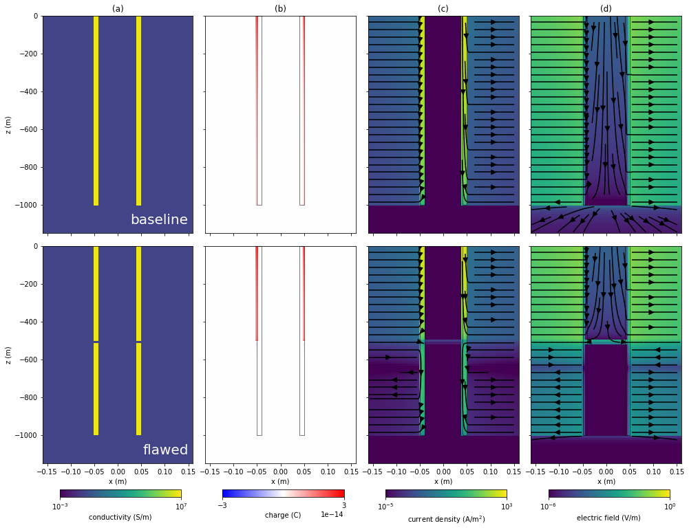

**| [Overview](#overview) | [Launching the notebooks](#launching-the-notebooks) | [Running the notebooks](#running-the-notebooks) | [Issues](#issues) | [License](#license) |**

# heagy-2018-dc-casing

[](https://travis-ci.org/simpeg-research/heagy-2018-dc-casing)
[](https://mybinder.org/v2/gh/simpeg-research/heagy-2018-dc-casing/master?filepath=index.ipynb)
[](https://notebooks.azure.com/import/gh/simpeg-research/heagy-2018-dc-casing)
[](https://github.com/simpeg-research/heagy-2018-emcyl/blob/master/LICENSE)
[](http://simpeg.xyz)



## Overview

This repository contains the notebooks used to generate the examples shown in "Direct current resistivity with steel-cased wells" by [Lindsey J. Heagy](https://github.com/lheagy) and [Douglas W. Oldenburg](https://github.com/dougoldenburg). 


- [1_DC_Flawed_Steel_Cased_Wells.ipynb](notebooks/1_DC_Flawed_Steel_Cased_Wells.ipynb) 
    - examines the feasibility of using DC resistivity for detecting a flaw in a steel-cased well and investigates the impact of parameters such as the background conductivity on our ability to detect a flaw from data collected at the surface. 
    - This notebook was used to produce Figures 1, 2, 4, 5, 6, 9, 10, 11

- [2_DC_Flawed_Steel_Cased_Wells_Short_well.ipynb](notebooks/2_DC_Flawed_Steel_Cased_Wells_Short_well.ipynb)
    - looks at hte impact of the vertical extent of the flaw on the distribution of charges.
    - Used to produce Figure 3. 

- [3_DC_Flawed_Steel_Cased_Wells_layer](notebooks/3_DC_Flawed_Steel_Cased_Wells_layer) 
    - looks at the impact of a conductive or resistive layer on our ability to detect a flaw. 
    - Used to create Figures 7, 8

- [4_DC_source_location.ipynb](notebooks/4_DC_source_location.ipynb)
    - looks at the impact of the source electrode location on our ability to deliver current to depth. 
    - This was used to produce Figures 12, 13

- [5_DC_target.ipynb](notebooks/5_DC_target.ipynb)
    - Examines our ability to excite a conductive or resistive target at depth, looks at the impact of having an electrical connection (or not) between the target and the casing
    - This notebook was used to produce Tables 1, 2 and Figures 14, 15, 16, 17, 18

- [6_DC_target_3D_cartesian.ipynb](notebooks/6_DC_target_3D_cartesian.ipynb)
    - here, we use a born approximation approach to examine our ability to excite a target offset from the well. 
    - This notebook was used to produce Figures 19, 20, 21 

- [7_DC_Approximating_Steel_Cased_Wells.ipynb](notebooks/7_DC_Approximating_Steel_Cased_Wells.ipynb)
    - This notebook looks at approximations of a steel cased well by a solid cylinder, either with a conductivity equal to steel, or a conductivity that preserves the cross-sectional conductance of the well. 
    - This notebook was used to produce Figures 22, 23

- [8_DC_Approximating_Steel_Cased_Wells_layered_background.ipynb](notebooks/8_DC_Approximating_Steel_Cased_Wells_layered_background.ipynb)
    - Similar to notebook 7, this notebook looks at approximations to the steel cased well by a solid cylinder in a layered background. 
    - It was used to produce Figures 24, 25

- [9_DC_Approximating_Steel_Cased_Wells_Cartesian.ipynb](notebooks/9_DC_Approximating_Steel_Cased_Wells_Cartesian.ipynb)
    - This notbook looks at approximations of the steel cased well onto a cartesian mesh. 
    - This notebook was used to create Figure 26 


## Launching the notebooks

### Online
The notebooks can be run online through [mybinder](https://mybinder.org/v2/gh/simpeg-research/heagy-2018-dc-casing/master?filepath=index.ipynb) or [azure notebooks](https://notebooks.azure.com/import/gh/simpeg-research/heagy-2018-dc-casing/master).

### Locally
To run them locally, you will need to have python installed, preferably through [anaconda](https://www.anaconda.com/download/).

You can then clone this reposiroty. From a command line, run

```
git clone https://github.com/simpeg-research/heagy-2018-dc-casing.git
```

Then `cd` into the `heagy-2018-dc-casing`

```
cd heagy-2018-dc-casing
```

To setup your software environment, we recommend you use the provided conda environment

```
conda env create -f environment.yml
source activate dc-casing-environment
```

alternatively, you can install dependencies through pypi
```
pip install -r requirements.txt
```

You can then launch Jupyter
```
jupyter notebook
```

Jupyter will then launch in your web-browser.

## Running the notebooks

Each cell of code can be run with `shift + enter` or you can run the entire notebook by selecting `cell`, `Run All` in the toolbar.


For more information on running Jupyter notebooks, see the [Jupyter Documentation](https://jupyter.readthedocs.io/en/latest/)

## Issues

If you run into problems or bugs, please let us know by [creating an issue](https://github.com/simpeg-research/heagy-2018-dc-casing/issues/new) in this repository.

## License

These notebooks are licensed under the [MIT License](/LICENSE) which allows academic and commercial re-use and adaptation of this work.
